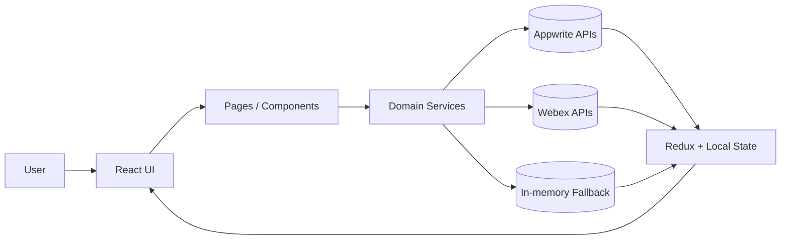
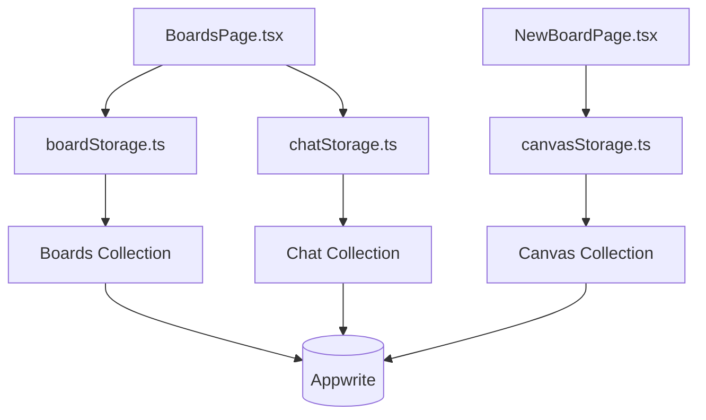
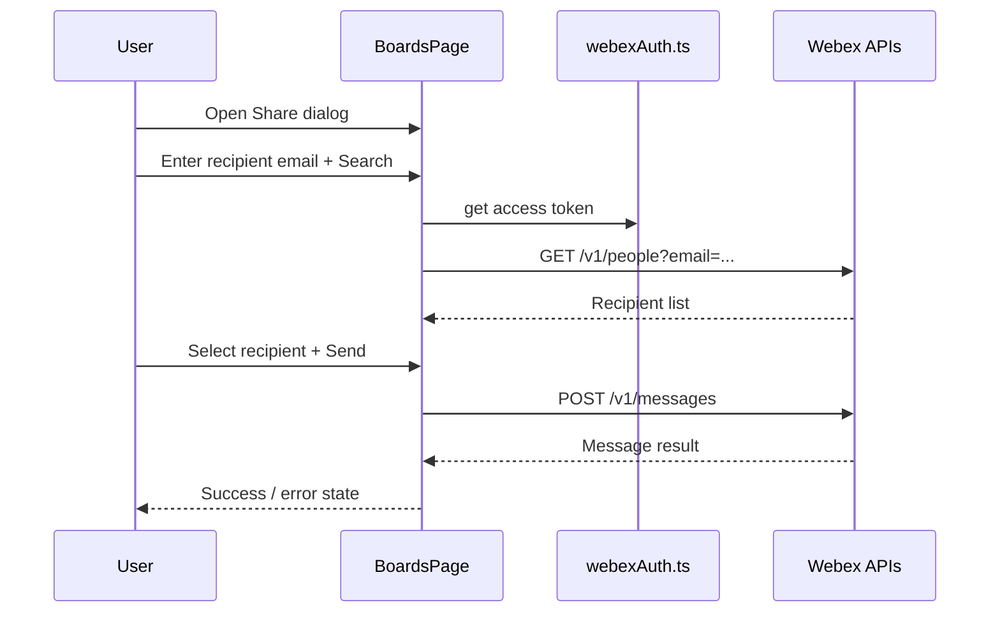
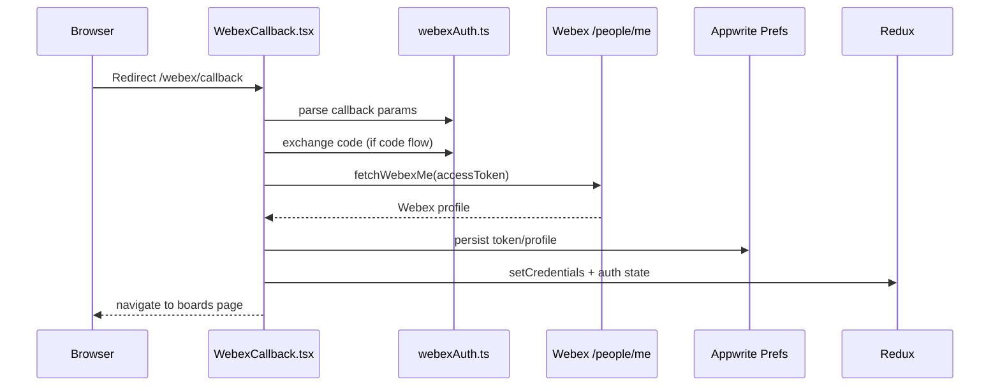
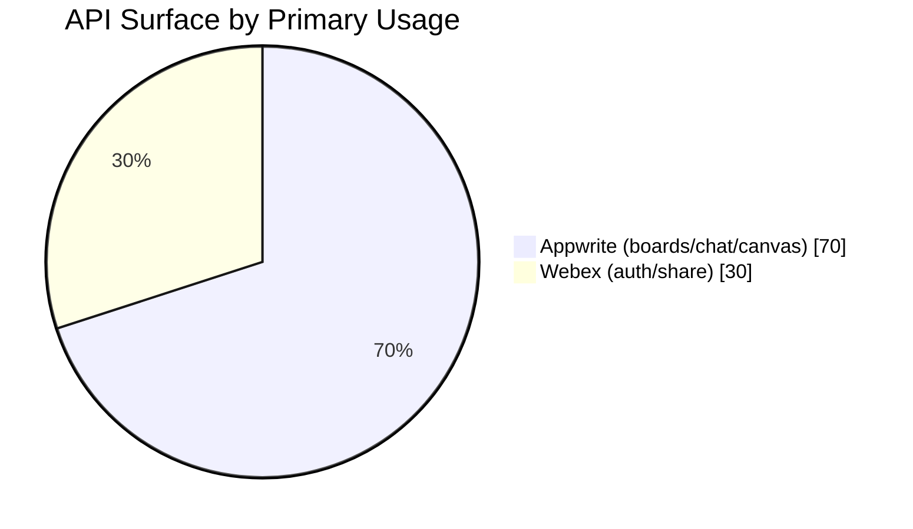
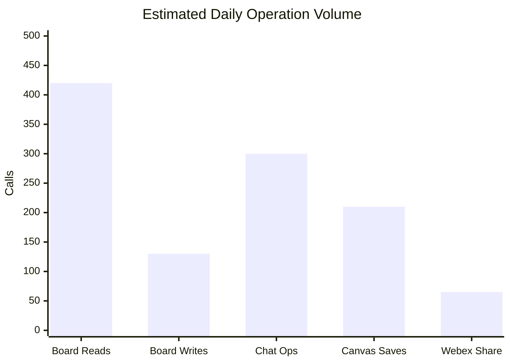

# Architecture Diagrams

This file provides visual diagrams for the Cisco Dashboard Clone using Mermaid.

## 1. High-Level Runtime Flow

## 2. Board and Data Services Mapping

## 3. Webex Share Flow

## 4. OAuth Callback Flow

## 5. API Usage Split (Example Pie Chart)

## 6. Key Operation Volume (Example Bar Chart)

