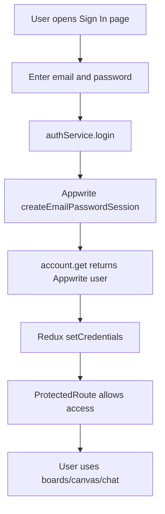
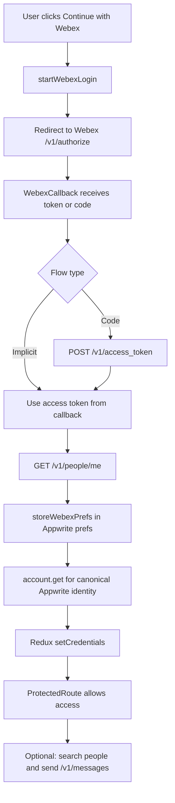

# Integration Flow Documentation

## Purpose
This document explains the complete technical flow of this project, including:
- system architecture
- authentication flows
- Webex integration APIs
- Appwrite integration responsibilities
- board/canvas/chat persistence
- board sharing via Webex direct message
- error handling and troubleshooting

Audience:
- evaluators who need a full feature and integration view
- engineers who need implementation-level references

---

## System Overview

### Stack Summary
- Frontend: React + TypeScript + Vite
- State management: Redux Toolkit
- Backend services: Appwrite (auth, database, preferences)
- External integration: Webex OAuth + Webex REST APIs

### Subsystem Responsibilities

#### Frontend UI and Routes
- Handles sign-in, boards listing, board creation, canvas editing, and share dialog UI.
- Main route wiring lives in `src/App/App.tsx`.

#### Appwrite Data and Session Layer
- Provides account/session identity (`account.get`, login/register/logout).
- Stores:
  - board metadata
  - canvas serialized nodes/edges
  - chat messages
  - Webex token metadata in account prefs (`webex` object)

#### Webex OAuth + API Layer
- Handles login redirect, callback parsing, optional code exchange path, profile fetch, people search, and direct message send.
- Central logic is in `src/features/dashboard/components/auth/webexAuth.ts`.

#### Redux State Layer
- Maintains authenticated user state and chat state.
- Canonical auth identity in Redux is Appwrite user ID (`state.auth.user.$id`).

---

## High-Level User Journeys

### 1. Sign In (Email/Password)
1. User submits credentials in `SignIn`.
2. `authService.login` creates Appwrite session and returns `account.get()`.
3. `authSlice` stores user in Redux.
4. Protected routes become available.

### 2. Sign In (Webex OAuth)
1. User clicks "Continue with Webex".
2. App redirects to Webex authorize endpoint.
3. Callback route (`/webex/callback`) parses returned OAuth data.
4. App fetches Webex profile (`people/me`).
5. App stores Webex token metadata into Appwrite prefs (`webex` key).
6. App verifies token was persisted.
7. App sets Redux credentials using Appwrite account identity (`account.get()`).

### 3. Create Board
1. Boards page calls `createBoard(userId)`.
2. Board document is created in Appwrite boards collection.
3. Permissions are scoped with `Role.user(userId)`.

### 4. Add Graph to Canvas and Persist
1. Drag/drop updates `droppedNodes` in `DragDropWrapper`.
2. `saveCanvas` serializes nodes/edges to JSON strings.
3. Appwrite canvas document is created/updated for that board.
4. Board widget summary is also updated in boards collection.

### 5. Open Boards Page and Previews
1. Boards page loads readable boards and chat summaries.
2. Cards render generated visual previews.
3. Menu actions (Share/Pin/Delete) are available on board cards.

### 6. Share Board via Webex DM
1. User clicks Share in board card menu.
2. Share dialog opens.
3. User enters recipient email and searches Webex People API.
4. User selects recipient and sends DM.
5. Message payload includes greeting + board link + board ID.

### 7. Delete Board and Related Cleanup
1. User confirms board deletion dialog.
2. Board is deleted.
3. Cleanup attempts run for canvas and chat documents.

---

## Architecture and Code Map

| Concern | Main Files |
|---|---|
| Route orchestration | `src/App/App.tsx` |
| Webex OAuth and API calls | `src/features/dashboard/components/auth/webexAuth.ts` |
| OAuth callback logic | `src/features/dashboard/components/auth/WebexCallback.tsx` |
| Webex token storage/retrieval in prefs | `src/features/dashboard/components/utils/webexStorage.ts` |
| Appwrite auth/database service | `src/features/dashboard/components/utils/authService.ts` |
| Board data operations | `src/data/boardStorage.ts` |
| Canvas persistence operations | `src/data/canvasStorage.ts` |
| Chat persistence operations | `src/data/chatStorage.ts` |
| Boards page + share dialog UI | `src/features/dashboard/BoardsPage.tsx` |
| Canvas drag/drop and save loop | `src/shared/hooks/DragDropWrapper.tsx` |
| Auth state machine | `src/store/authSlice.ts` |

---

## Authentication Flow

## Email/Password Path
- Entry UI: `src/features/dashboard/components/auth/SignIn.tsx`
- Service: `authService.login(email, password)`
- Behavior:
  - creates Appwrite session via email/password
  - returns Appwrite account object
  - Redux `setCredentials` updates auth state

## Webex OAuth Path
- Start:
  - `startWebexLogin` in `webexAuth.ts`
  - redirects to `https://webexapis.com/v1/authorize`
- Callback:
  - `WebexCallback.tsx` calls `parseWebexCallback`
  - validates OAuth state
  - uses access token directly (implicit) or exchanges code (if configured)
- Profile fetch:
  - `fetchWebexMe` (`GET /v1/people/me`)
- Token persistence:
  - `storeWebexPrefs` writes `webex` object into Appwrite account prefs
  - callback verifies persisted token exists and matches
- Canonical identity:
  - callback uses `account.get()` and dispatches Appwrite account ID to Redux

## Session Validity and Route Protection
- `ProtectedRoute` uses:
  - Appwrite account check first
  - fallback Webex session validity helper
- `authSlice.checkAuthStatus`:
  - prioritizes `authService.getCurrentUser()`
  - if needed, reads Webex metadata from prefs

---

## Webex Integration (Detailed)

## Why Webex Is Used
- External identity provider option for sign-in.
- Collaboration channel for board-sharing notifications through Webex direct messages.

## Current Capabilities
1. OAuth login (authorize + callback handling)
2. Fetch signed-in user profile (`people/me`)
3. Search recipient by email (`people?email=...`)
4. Send direct message (`messages`)

## Share Dialog Behavior
- Implemented in `src/features/dashboard/BoardsPage.tsx`.
- User flow:
  1. Open share dialog from board card.
  2. Enter recipient email and search.
  3. Select recipient result.
  4. Send message.

## Message Format
- Greeting line
- Board link: `/newboard/:boardId`
- Board ID fallback line

## Integration Limitations
- People search visibility is restricted by Webex org policies and directory scope.
- DM send may fail without required scopes, org roles, or licensing.
- DM send does not currently modify Appwrite ACLs (notification-only sharing in current scope).

---

## Appwrite Integration (Detailed)

## What Appwrite Stores
1. Account/session data
2. Account preferences:
   - theme preference
   - `webex` object (access token metadata and profile-related values)
3. Boards collection
4. Canvas collection
5. Chat messages collection

## Permission Model
- Document permissions are user-scoped with `Role.user(userId)`.
- `userId` should be Appwrite account ID (`state.auth.user.$id`) for consistent access behavior.

## Data Layer Fallback Behavior
- Current data modules include in-memory fallback maps in error paths.
- In-memory fallback is non-durable and can be lost on refresh/reload.

---

## API Endpoint Reference

## Webex APIs

| Endpoint | Method | Purpose | Called From | Required Scope(s) | Input | Output Used | Common Errors |
|---|---|---|---|---|---|---|---|
| `/v1/authorize` | GET (redirect) | Start OAuth flow | `startWebexLogin` | Scopes passed in request (`scope`) | `client_id`, `redirect_uri`, `scope`, `state`, flow params | Browser redirected to Webex consent and back to callback | Invalid redirect URI, misconfigured OAuth app |
| `/v1/access_token` | POST | Exchange authorization code for tokens (code flow only) | `exchangeWebexCodeForToken` | OAuth app must support authorization code flow | `grant_type`, `client_id`, `code`, `redirect_uri`, optional `code_verifier` | `access_token`, `refresh_token`, `expires_in` | `client_secret cannot be null or empty` when flow/app type mismatches |
| `/v1/people/me` | GET | Fetch signed-in Webex profile | `fetchWebexMe` | `spark:people_read` | Bearer token | `id`, `displayName`, `emails` | Invalid or expired token |
| `/v1/people?email=...` | GET | Find recipient by email | `searchWebexPeopleByEmail` | `spark:people_read` | Bearer token and email query | `items[]` (person records including IDs) | No results due org visibility / directory limits |
| `/v1/messages` | POST | Send board details as direct message | `sendWebexDirectMessage` | `spark:messages_write` | `toPersonId`, `markdown`, optional `text` | Message response confirmation | Missing scope, entitlement, or forbidden response |
## Appwrite SDK Operations

| SDK Operation | Where Used | Purpose |
|---|---|---|
| `account.get` | auth/webex helpers, auth service | Resolve canonical Appwrite identity/session |
| `account.createEmailPasswordSession` | `authService.login` | Email/password login |
| `account.create` | `authService.register` | User registration |
| `account.deleteSession("current")` | `authService.logout` | Logout |
| `account.updatePrefs` | webex storage, theme prefs | Persist `webex` token data and theme |
| `account.getPrefs` | webex session checks and token retrieval | Read persisted `webex` metadata |
| `databases.createDocument` | board/chat/canvas writes | Insert new records |
| `databases.listDocuments` | board/chat/canvas reads/searches | Fetch records |
| `databases.updateDocument` | board/chat/canvas updates | Persist edits |
| `databases.deleteDocument` | board cleanup | Delete records |

---

## Data Models

## Board
- Source: `src/data/boardStorage.ts`
- Key fields:
  - `id`
  - `userId` (owner, Appwrite identity)
  - `title`
  - `widgets[]`
  - `isPinned`

## Widget
- Represents board-level chart/widget metadata.
- Includes position and optional props/data.

## Chat Message
- Source: `src/data/chatStorage.ts`
- Key fields:
  - `id`
  - `role` (`user` / `assistant`)
  - `text`
  - optional chart/graph data

## Canvas
- Source: `src/data/canvasStorage.ts`
- Stored as serialized JSON strings:
  - `nodesjson`
  - `edgesjson`

## Identity Note
- Canonical runtime owner identity is Appwrite user ID in Redux.
- Webex user ID is metadata (stored in prefs) and not the permissions principal for Appwrite documents.

---

## Environment Variables (Redacted Examples)

| Variable | Purpose | Example (Redacted) |
|---|---|---|
| `VITE_APPWRITE_ENDPOINT` | Appwrite API endpoint | `https://<region>.cloud.appwrite.io/v1` |
| `VITE_APPWRITE_PROJECT_ID` | Appwrite project ID | `<project_id>` |
| `VITE_APPWRITE_DATABASE_ID` | Database ID | `<database_id>` |
| `VITE_APPWRITE_COLLECTION_BOARDS` | Boards collection key | `boards` |
| `VITE_APPWRITE_COLLECTION_CANVAS` | Canvas collection key | `board_canvas` |
| `VITE_APPWRITE_COLLECTION_CHAT` | Chat collection key | `chat_messages` |
| `VITE_WEBEX_CLIENT_ID` | Webex OAuth app client ID | `<webex_client_id>` |
| `VITE_WEBEX_REDIRECT_URI` | OAuth callback URL | `http://localhost:5173/webex/callback` |
| `VITE_WEBEX_SCOPES` | Requested Webex scopes | `spark:people_read spark:messages_write` |
| `VITE_WEBEX_OAUTH_FLOW` | OAuth flow mode | `implicit` (current frontend-safe default) |

Note:
- Do not place Webex `client_secret` in frontend code.

---

## Error Handling and Known Issues

## 1. Token Persistence Failures
- Symptom: Share flow reports missing/expired token.
- Cause: `account.updatePrefs({ webex: ... })` failed or session not available.
- Current behavior: callback throws explicit token persistence errors.

## 2. "Webex session expired. Please sign in with Webex again."
- Trigger: no valid `webex.accessToken` in Appwrite prefs at action time.

## 3. Missing Scope / Role / License Errors
- Webex may return forbidden-style errors even when request format is valid.
- Causes:
  - missing scope in token
  - org policy restrictions
  - missing user entitlement/license

## 4. `client_secret cannot be null or empty`
- Happens when token exchange path is used but OAuth app/flow expects confidential client behavior.
- Usually indicates mismatch between configured OAuth flow and app registration setup.

## 5. Canvas Schema Length Errors
- Example:
  - `nodesjson ... no longer than 200 chars`
- Fix:
  - increase Appwrite attribute size for serialized canvas payload fields.

---

## Troubleshooting Playbooks

## A. "Share search says no user found"
- Symptom:
  - valid-looking email returns no results
- Likely causes:
  - email not exact
  - user outside visible org/directory scope
  - Webex discovery restrictions
- Verify:
  1. confirm exact email string
  2. check response from `/v1/people?email=...`
- Resolve:
  - use exact email
  - validate org visibility policy
  - test with an internally visible user account

## B. "DM send forbidden"
- Symptom:
  - message send fails with permission/scope error
- Likely causes:
  - missing `spark:messages_write`
  - token issued before scope update
  - org role/license restrictions
- Verify:
  1. inspect failing `/v1/messages` response
  2. confirm token is newly issued after scope changes
- Resolve:
  - update scopes and re-authenticate
  - verify org entitlements with admin

## C. "Token missing after login"
- Symptom:
  - callback succeeds partially, share says session expired
- Likely causes:
  - prefs write failed
  - Appwrite session not available
- Verify:
  - inspect callback error text and console logs
  - check `account.getPrefs().webex`
- Resolve:
  - re-login Webex
  - ensure Appwrite session creation succeeds
  - resolve cookie/session policy blockers

## D. "Canvas not saved after refresh"
- Symptom:
  - added graph disappears after reload
- Likely causes:
  - Appwrite write failed
  - schema rejected payload
  - non-durable fallback used after failure
- Verify:
  1. inspect failing Appwrite request in network tab
  2. check collection attribute constraints
- Resolve:
  - fix schema/permissions
  - retry save with valid payload sizes

---

## Security Notes
- Never put Webex `client_secret` in frontend environment variables.
- Token is stored in Appwrite prefs under user account context.
- Sharing in current scope is DM notification only; it does not grant Appwrite ACL access to board data.

---

## Current Scope vs Future Enhancements

## Current Scope
- Board share through Webex DM from board cards.
- Recipient lookup by email.
- Message payload includes link and board ID.
- No Appwrite ACL mutation during share.

## Potential Future Enhancements
1. ACL-based board sharing in Appwrite (real access grant/revoke)
2. Better recipient discovery UX (multi-field, ranking, fallback by email send mode)
3. Retries + telemetry/monitoring for save and share failures
4. Deeper collaboration model (shared board ownership metadata, activity logs)

## End-to-End Flow Diagrams

### Normal User (Email/Password)

### Webex User (OAuth)

---

## Quick Validation Checklist
- [ ] Email/password login works
- [ ] Webex login flow completes without callback error
- [ ] `webex.accessToken` present in Appwrite prefs after Webex login
- [ ] Board CRUD works
- [ ] Canvas save/load persists across refresh
- [ ] Chat save/load works
- [ ] Share search returns expected users (where org visibility allows)
- [ ] Share DM sends with board link and ID
- [ ] Error messages are actionable for common failures

---

## Key Interface/Type Rules
1. `state.auth.user.$id` is canonical Appwrite identity.
2. Webex metadata is stored separately in prefs (`webex.userId`, token fields).
3. Share action reads Webex token from Appwrite prefs at runtime.
4. Shared board URL format is `/newboard/:boardId`.

